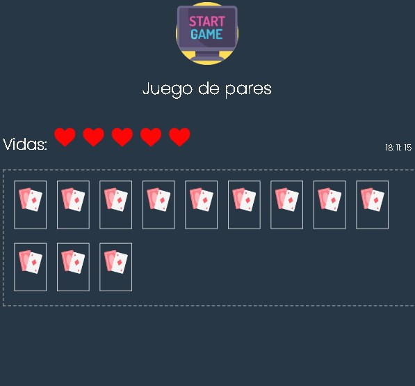

    <h1 align="center">Juego de pares</h1>

    <h3> 🔨 Desarrollado con html, css y javascript</h3>

 

<h3> El jugador tiene 5 vidas y a medida que vaya seleccionando un par incorrecto, va perdiendo cada una de ellas</h3>
   

